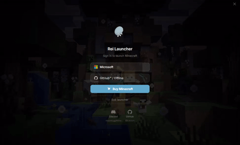

<div align="center">
  
  <h1>Rei Launcher</h1>

  [](https://www.electronjs.org/)
  [](https://nodejs.org/)
  [](LICENSE)
</div>

**Rei Launcher** is a "Premium" Minecraft launcher focused on design and simplicity. Heavily inspired by **Rei Ayanami from Neon Genesis Evangelion**, this project combines a minimalist dark aesthetic with robust functionality to give you the ultimate pilot—*err, player*—experience.

## 🌐 Coming Soon: Official Website!

We are currently working on a **dedicated website** for Rei Launcher! Once it's live, we will provide official download links for Windows, Linux, and macOS. Stay tuned for the first public release!

## ✨ Features

- 🔐 **Flexible Authentication:** Full support for Microsoft OAuth 2.0 and Offline mode.
- 🚀 **Performance:** Fast game startup powered by `minecraft-launcher-core`.
- 📰 **News Feed:** Integrated weekly news system with tag filters and search functionality.
- 🎨 **Premium Interface:** Dark UI meticulously recreated from professional Behance designs (Breus Studio / Infinity Universe).
- 🔄 **Auto-Updates:** Built-in update system via GitHub Releases to ensure you're always on the latest version.
- 🛠️ **Smart Config:** Automatic Java detection and profile management.
- 🔒 **Secure:** Built with `contextIsolation` and modern Electron security best practices.

## 📸 Preview

<div align="center">
  
  <p><i>Login Screen Preview</i></p>
</div>

## 🚀 Getting Started (Development)

If you want to run the launcher from source:

### Prerequisites
- [Node.js](https://nodejs.org/) (Version 20 recommended)
- [pnpm](https://pnpm.io/) or npm

### Installation
1. Clone the repository:
   ```bash
   git clone https://github.com/EduhxH/rei-launcher.git
   ```
2. Install dependencies:
   ```bash
   npm install
   ```
3. Start the application:
   ```bash
   npm start
   ```

## 🏗️ Build and Distribution

To generate executables for different platforms:

```bash
# Windows (.exe)
npm run dist:win

# Linux (.AppImage)
npm run dist:linux

# macOS (.dmg)
npm run dist:mac
```

## 📁 Project Structure

```text
rei-launcher/
├── src/
│   ├── main/         # Electron main process
│   ├── renderer/     # User interface and logic (HTML/JS)
│   ├── styles/       # Global CSS styling
│   └── assets/       # Images and static assets
├── build/            # Build configurations and icons
└── .github/          # CI/CD workflows
```

## 🤝 Credits & Acknowledgments

This project wouldn't be possible without a little help from my friends (both human and silicon):

- **Filipe:** For helping me wrestle with the code and making sure the launcher actually launches.
- **Claude Code:** My AI "intern" who basically carried the entire UI design on its back while I took the credit. (Don't tell the robots, they're sensitive).
- **Breus Studio / Infinity Universe:** For the incredible visual inspiration.

## 📄 License

This project is licensed under the MIT License. See the [LICENSE](LICENSE) file for details.

---
Built with ❤️ and LCL by [EduhxH](https://github.com/EduhxH)

